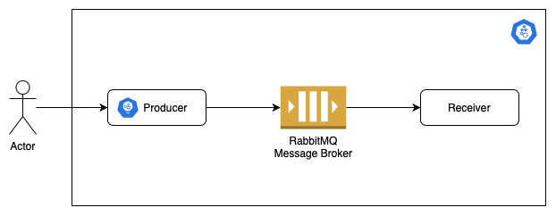

# python-rabbitmq-docker

In this project, the main objective was to learn how to create an application that sends and receives a message from a RabbitMQ message broker, using Docker and docker-compose tools.

## Stack

- aiohttp
- Docker
- RabbitMQ
- Pika
- Python 3.8

## How to use

### Using Docker Compose 
You will need Docker installed to follow the next step. To create and run the image use the following command:
```bash
docker-compose up --build
```

The configuration will create a cluster with 3 containers:

- Producer container
- Receiver container
- RabbitMQ container

The Producer container will create a simple RESTful API application that sends data to the message broker (RabbitMQ). It will take a few seconds to come up, then the server will be accessible at `http://localhost:7000`.

The Receiver container is a script that aims to wait and receive messages from Message Broker.

And the RabbitMQ container is where messages flow through RabbitMQ and applications, stored inside a queue. A web browser access to the Dashboard is also provided for RabbitMQ message management and monitoring which can be accessed at `http://localhost:15672`.


### API
- Send Message
Request to send message to Message Broker. Below is an example request:
```json
POST http://localhost:7000/
Accept: application/json
Content-Type: application/json
Body:
{
    "key": "value",
}
```

- Health check
Request to check if the application is available.
```json
GET http://localhost:7000/
Accept: application/json
Content-Type: application/json
```

## Project Structure
Below is a project structure created:

```cmd
.
├── README.md
├── docker-compose.yml
├── producer
│   ├── Dockerfile
│   ├── api
│   │   ├── __init__.py
│   │   ├── __main__.py
│   │   ├── enum.py
│   │   ├── gateway
│   │   │   ├── __init__.py
│   │   │   └── rabbitmq.py
│   │   └── services
│   │       ├── __init__.py
│   │       └── handler.py
│   ├── app.py
│   └── requirements.txt
└── receiver
    ├── Dockerfile
    ├── api
    │   ├── __init__.py
    │   ├── __main__.py
    │   ├── enums.py
    │   └── gateway
    │       ├── __init__.py
    │       └── rabbitmq.py
    ├── app.py
    └── requirements.txt
```

## Architecture




## Environment Variables
Listed below are the environment variables needed to run the application. They can be included in docker-compose or to run locally, you need to create an `.env` file in the root of the Producer and Receiver service folders.

- Receiver:
```cmd
RABBITMQ_USERNAME:
RABBITMQ_PASSSWORD:
RABBITMQ_HOST:
RABBITMQ_QUEUE:
RABBITMQ_ROUTING_KEY:
RABBITMQ_EXCHANGE:
```

- Producer:
```cmd
RABBITMQ_USERNAME:
RABBITMQ_PASSSWORD:
RABBITMQ_HOST:
RABBITMQ_QUEUE:
RABBITMQ_ROUTING_KEY:
RABBITMQ_EXCHANGE:
SERVER_PORT:
SERVER_HOST:
```

- RabbitMQ:
```cmd
RABBITMQ_DEFAULT_USER:
RABBITMQ_DEFAULT_PASS:
```

## Help and Resources
You can read more about the tools documentation:

- [aiohttp](https://docs.aiohttp.org/en/stable/index.html)
- [Docker](https://docs.docker.com/get-started/overview/)
- [RabbitMQ](https://www.rabbitmq.com)
- [Pika](https://pika.readthedocs.io/en/stable/#)